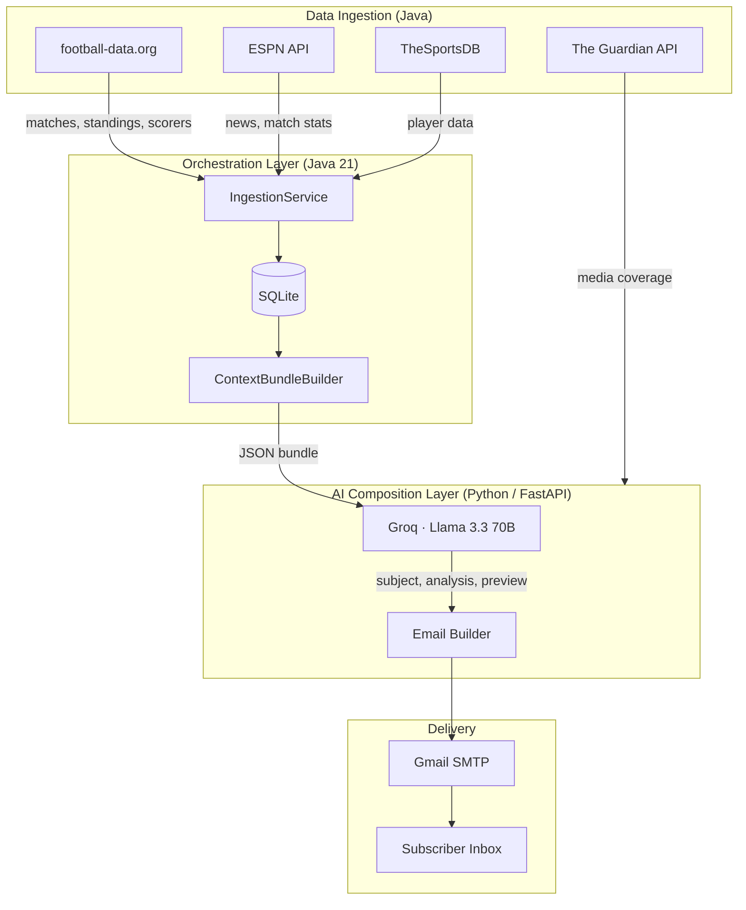
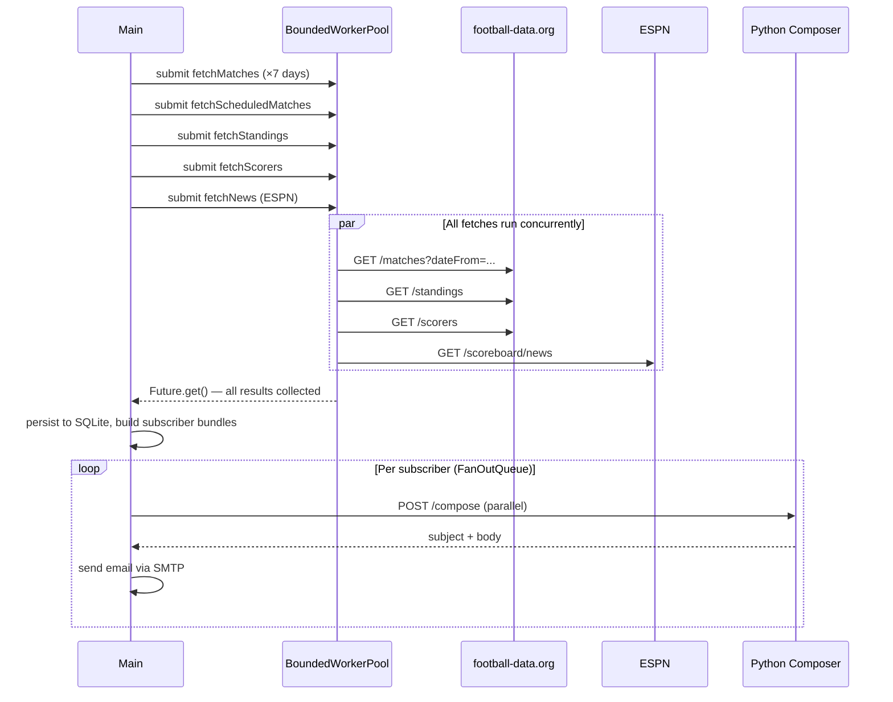

# World Cup 2026 · Daily Newsletter

**A production-grade, AI-powered newsletter pipeline — built from scratch with Java, Python, and deployed to Oracle Cloud.**

Every morning of the tournament, subscribers receive a personalised email about the team they follow: yesterday's result, live group standings, what the media is saying, and what's coming next. Written by an LLM. Delivered without manual intervention.

---

## Architecture



---

## Concurrency Model

The pipeline is built around a bounded thread pool with fan-out parallelism at two stages: data ingestion and email dispatch.



**Key concurrency primitives:**

| Component | Role |
|---|---|
| `BoundedWorkerPool` | Fixed thread pool (4 workers, 16-task queue) wrapping `ThreadPoolExecutor` |
| `Future<T>` | Non-blocking task submission; main thread collects results with `.get()` |
| `FanOutQueue` | Parallel fan-out for per-subscriber composition + delivery; failed jobs go to dead-letter list |
| `RetryWithBackoff` | Exponential backoff (5s → 10s → 20s) around all external API calls |
| `RateLimiter` | Token-bucket limiter enforcing football-data.org's 10 req/min free-tier constraint |

---

## AI Composition

Each email is composed by **Llama 3.3 70B** (via Groq) against a structured data bundle — not a template fill-in. The LLM writes:

- A punchy subject line
- A single sharp opening sentence
- A two-paragraph analysis section:
  - **Paragraph 1** — data-grounded match facts and standings
  - **Paragraph 2** — media narrative drawn from live Guardian API coverage; situates the team in the wider tournament conversation
- A fixture preview for the next match

The prompt enforces strict grounding: the model is explicitly instructed not to state any fact not present in the data bundle, preventing hallucinated scorelines or invented results.

---

## Cloud Deployment

Deployed to **Oracle Cloud Infrastructure (OCI) Always Free** tier:

- **Compute:** `VM.Standard.E2.1.Micro` (1 OCPU / 1 GB RAM, AMD) — zero cost, indefinitely
- **Reverse proxy:** nginx on port 80, forwarding to FastAPI on port 8000
- **Process management:** systemd service for the Python composer (auto-restart on crash, starts on boot)
- **Scheduling:** cron job triggers the Java pipeline daily at 03:00 UTC (09:00 Dhaka)
- **Storage:** SQLite on-disk — sufficient for tournament-scale subscriber counts, no managed DB cost

The Java pipeline produces a fat JAR (via `maven-shade-plugin`) containing all dependencies, so the server needs only a JRE to run it.

---

## Sign Up

Visit **[http://152.67.100.118](http://152.67.100.118)**, pick your team and timezone, and you're done.

No accounts. No app. Just your inbox.

---

## What You Get

Every morning of the tournament, one email built around the team you care about.

**Yesterday's result.** Full match recap with the scoreline and what it means for your team's campaign.

**Where your team stands.** Live group standings with goal difference, points, and what they need to advance.

**What the media is saying.** A second read on the day — what journalists and pundits are actually writing about your team right now.

**What's coming next.** Fixture preview with kickoff time in your local timezone.

If your team gets knocked out, you'll receive one final send-off email — then your newsletter stops quietly.

---

## Tech Stack

| Layer | Technology |
|---|---|
| Pipeline orchestration | Java 21, Maven |
| Concurrency | `ThreadPoolExecutor`, `Future<T>`, custom `FanOutQueue` |
| AI composition | Python 3.11, FastAPI, Llama 3.3 70B via Groq |
| Data sources | football-data.org, ESPN, TheSportsDB, The Guardian |
| Storage | SQLite (JDBC) |
| Email delivery | Jakarta Mail, Gmail SMTP |
| Hosting | Oracle Cloud Infrastructure (Always Free) |
| Reverse proxy | nginx |

---

## Self-Hosting

**Prerequisites:** Java 21+, Python 3.11+, Maven, an SMTP account

**1. Clone and configure**

```bash
git clone https://github.com/MujiDipto/fifa-wc-newsletter.git
cd fifa-wc-newsletter
cp .env.example .env
```

Fill in `.env`:

```env
FOOTBALL_DATA_API_TOKEN=   # free at football-data.org
GROQ_API_KEY=              # free at console.groq.com
GUARDIAN_API_KEY=          # free at open-platform.theguardian.com
SMTP_HOST=
SMTP_PORT=
SMTP_USERNAME=
SMTP_PASSWORD=
```

**2. Start the AI composer**

```bash
cd python-composer
python3.11 -m venv venv && source venv/bin/activate
pip install -r requirements.txt
uvicorn main:app --host 127.0.0.1 --port 8000
```

**3. Build and run**

```bash
mvn package -DskipTests
java -jar target/worldcup-newsletter-1.0-SNAPSHOT.jar
```

Schedule step 3 daily with cron and you're done.

---

## License

MIT
